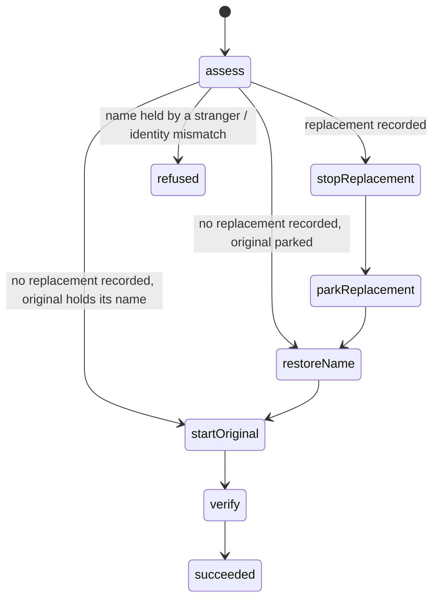

# HarborMaster vs Watchtower Audit

Date: 2026-09-16. Scope: the container update ("recreation") lifecycle in
`internal/service`, `internal/docker`, `internal/domain`, `internal/store`, and
the automation follower, compared against Watchtower `main` (`ca0e86e`,
2025-12-17), whose source was fetched and read for this audit.

Every claim below cites a file and function. Line numbers are approximate.

---

## 1. Executive Summary

**HarborMaster's update engine is safe for unattended production use with respect
to data and configuration, and it is NOT yet safe with respect to availability.**

The engine is built as a rename/swap transaction (Strategy B + D from the brief):
the original container is stopped and **parked** under a derived name, never
removed, until a replacement has been created, started, and proven on four
independent checks, and the success has been durably recorded. Configuration is
captured verbatim from the daemon's own `Config`, `HostConfig`, and
`NetworkSettings` structures and re-sent with only the image, the daemon-derived
hostname, and runtime addressing changed. Every mutation is followed by a durable
checkpoint. On every axis the brief asks about — destructive boundary, identity,
configuration fidelity, pruning, concurrency, crash recovery — HarborMaster is
materially ahead of Watchtower, which force-removes the old container before
creating the new one, never waits for health, has no rollback, and force-removes
images.

The availability gap is one specific design decision and one specific defect
inside it:

1. **By design, a failure after the mutation point is never undone by the
   recreation itself.** The original is left stopped and parked; the replacement
   is quarantined. The only automatic recovery is the automation follower
   requesting the separate rollback service, and only when the governing policy
   has `failure.autoRollback` on. Manual updates get a recovery plan and a
   button.

2. **The rollback service structurally cannot recover the two failure states in
   which the workload is most certainly down: create failure and rename
   failure.** `RollbackService.assessRecords` refuses any execution whose
   `ReplacementID` is empty with `nothingToRollBack`, and
   `RollbackSufficientCheckpoint` excludes `originalStopped`. Those are exactly
   the states a create or rename failure leaves. The follower asks for the
   rollback, is refused, counts the failure, and pauses the container. The
   workload is down until a person runs two `docker` commands. This is the
   reported "stops the old container, fails to create the replacement, and
   stays stuck" behaviour, and it is a defect in the code's own terms: the
   rollback comment says the checkpoint window "is exact" and includes
   `originalParked`, while the record check three lines later refuses every
   `originalParked` failure that has no replacement.

Two further defects make create/start failures more likely or unrecoverable:

3. **Every mutation call has a 10-second client-side deadline**
   (`DOCKER_TIMEOUT`), including `ContainerCreate`, `ContainerStart`, and
   `ContainerRename`. A daemon that takes longer (GPU runtime hooks, many
   published ports, slow storage, Docker Desktop under load) produces a
   `timeout` failure after the mutation point while the daemon may complete the
   operation anyway, leaving an unrecorded replacement holding the production
   name — the one arrangement no automatic path can repair.

4. **A container with `HostConfig.AutoRemove` is destroyed by the stop itself.**
   Nothing on the recreate path reads `AutoRemove`; the daemon removes the
   container when it exits, the park rename then fails with not-found, and the
   original is gone with only an in-memory capture to reconstruct it from.

The fixes for 2, 3, and 4 are small, local, and implemented in this change
(section 13, P0). No redesign is needed. The architecture is sound; it was
missing the last leg of its own recovery path.

---

## 2. Most Likely Cause of the Stuck Container Problem

Reported behaviour: "HarborMaster stops/removes the old container, but sometimes
fails to successfully create/start the replacement and remains stuck."

### The exact path

1. `ExecutionService.mutate` (`internal/service/execution_pipeline.go:330`)
   stops the original (`StopContainer`), checkpoints `originalStopped`, renames
   it to `<name>.hm-old-<execId>` (`RenameContainer`), checkpoints
   `originalParked`.
2. `CreateContainer` (`execution_pipeline.go:408`) fails — daemon refusal,
   transient socket error, or the 10 s client deadline in
   `Client.CreateContainer` (`internal/docker/recreate.go:887`).
3. `failAfterMutation` (`execution_pipeline.go:737`) runs. Its own doc comment:
   *"It does not roll back. The original is not renamed back, not restarted, and
   not touched at all."* With no replacement, `quarantine` is a no-op. The
   record is written: `state=failed`, `failure=create`,
   `checkpoint=originalParked`, `replacementId=""`, recovery plan
   `urgency=urgent, serviceInterrupted=true`. **The workload is now down.**
4. For an automated update, `AutomationService.advanceExecution`
   (`internal/service/automation_follow.go:218`) sees the terminal failure on
   the next follower tick (30 s) and calls `handleFailedExecution`.
   `shouldRollback` passes (`RollbackSufficientCheckpoint(originalParked)` is
   true, the policy permits it) and `RequestRollback` is called.
5. `RollbackService.assessRecords` (`internal/service/rollback_preflight.go:118`)
   reaches: `if decision.OriginalID == "" || decision.ReplacementID == "" ... {
   return decision, domain.RollbackRefusalNothingToRollBack, nil }`. **Refused.**
   Even if it passed, `verifyIdentities` would refuse `replacementMissing`, and
   the pipeline's first mutation is `StopReplacement`.
6. The follower records `"the recreation did not succeed (create); automatic
   rollback was refused: ..."`, counts a failure, and pauses the container
   after the policy threshold (simple mode: 2). Nothing else will ever touch
   it. The dashboard shows a failed execution with an urgent recovery plan and,
   for the rollback button, "nothing to roll back" — for a container that is
   parked and stopped.

For a manual update, step 4 never happens: the recovery plan is the whole of the
response, and the rollback button reports "nothing to roll back".

### Why the create/start step fails "sometimes"

The preflight is thorough about HarborMaster's own evidence but the daemon can
still refuse or stall on things the preflight cannot see:

| Trigger | Where it surfaces | Foreseeable before the stop? |
| --- | --- | --- |
| Client-side 10 s deadline on `ContainerCreate`/`ContainerStart` (`DOCKER_TIMEOUT`) | `failure=timeout`, checkpoint `originalParked` or `replacementCreated` | No. Slow starts (NVIDIA runtime, many ports, slow disk) are normal. |
| Transient socket error (EOF, reset) on any mutation | `failure=create`/`start`/`rename` | No retry anywhere. |
| Daemon refusal of a config detail the preflight does not model (a device path that vanished, a bind source removed, a plugin network driver error) | `failure=create` or `start` | Partly. Namespaces are handled; devices and binds are not checked. |
| `AutoRemove` container removed by its own stop | `failure=rename` (not-found), checkpoint `originalStopped` | Yes, but `AutoRemove` is never read. |
| A `start_period` longer than `StartupTimeout` | `failure=healthTimeout`, quarantined | Yes; not modelled. |

Every one of these ends in the same place: the original parked and stopped, and
for the first four rows no automatic way back.

---

## 3. Critical Findings

### HM-01 — CRITICAL — Rollback cannot recover a create or rename failure

* **File/function:** `internal/service/rollback_preflight.go` `assessRecords`
  (the `ReplacementID == ""` refusal), `verifyIdentities` (unconditional
  replacement inspection); `internal/domain/rollback.go`
  `RollbackSufficientCheckpoint` (excludes `originalStopped`);
  `internal/service/rollback_pipeline.go` `mutate` (unconditional
  `StopReplacement` first).
* **Description:** The only automatic recovery path refuses precisely the two
  arrangements where no replacement exists, which are the arrangements where the
  workload is certainly down.
* **Failure scenario:** Create fails after park (any cause). Follower requests
  rollback → `nothingToRollBack`. Container paused. Workload down.
* **Operational impact:** Unattended outage until a person intervenes. The
  UI's rollback control says there is nothing to roll back.
* **Watchtower comparison:** Watchtower has no rollback at all; after a create
  failure the old container is already removed. HarborMaster preserved the
  original and then did not use it.
* **Remediation (implemented, P0-1):** Teach the rollback path the
  no-replacement arrangement: accept an empty `ReplacementID` when the
  checkpoint is `originalStopped` or `originalParked`; verify the original by
  id and accept it under either its parked name or its own name; require the
  production name to be free or held by the original itself; skip the two
  replacement steps; restore the name only when the live name is not already
  the production name; then start and verify as today. Store accepts an empty
  replacement id. Recovery plans gain no-replacement wording. Records that
  contradict themselves (a replacement named at `originalStopped`, or none
  named at `replacementCreated` or later) stay refused.

### HM-02 — HIGH — Manual updates never restore automatically

* **File/function:** `execution_pipeline.go` `failAfterMutation`;
  `internal/domain/execution.go` package comment ("nothing rolls back").
* **Description:** A manual recreation that fails after the mutation point
  leaves the workload down and waits for a person. Automation can opt into
  rollback; the manual path cannot.
* **Failure scenario:** Operator applies an update from the UI at 17:00, the
  replacement is unhealthy, quarantine runs, the original stays parked. Nothing
  serves until the operator notices.
* **Operational impact:** Availability depends on a human watching the page.
* **Watchtower comparison:** Same outcome or worse in Watchtower (old container
  gone). But Watchtower has no "manual" mode; the comparison is against the
  brief's invariant "restore whenever technically possible".
* **Remediation (P1, design decision for the owner):** Offer a per-deployment or
  per-request "restore the original automatically if the replacement fails"
  option for manual executions, implemented as the follower does it: submit a
  `RollbackRequest{ExecutionID}` on terminal failure. After P0-1 the rollback
  service can restore every post-mutation state that has a recorded
  arrangement, so this is wiring, not new capability. The notification wording
  in `notify_raise.go` currently promises the opposite and must change with it.

### HM-03 — HIGH — Mutation calls are bounded by the 10 s inspection timeout

* **File/function:** `internal/docker/recreate.go` `CreateContainer`,
  `StartContainer`, `RenameContainer` (`context.WithTimeout(ctx, c.timeout)`);
  `internal/docker/rollback.go` `ParkReplacement`, `RestoreOriginalName`,
  `StartOriginal`; `internal/config/config.go` `DefaultDockerTimeout = 10s`.
* **Description:** `StopContainer` was already given `grace + c.timeout` after a
  live failure (commit `18b777d`, "fix long-running Docker mutation timeouts");
  the other mutations were not. A create or start that takes longer than 10 s
  is classified `timeout` after the mutation point, while the daemon usually
  completes the request anyway.
* **Failure scenario:** `docker start` with the NVIDIA runtime takes 15 s. The
  client gives up at 10 s, the pipeline quarantines a container that then
  starts, and the original stays parked. Or: create takes 12 s, the pipeline
  records `originalParked` with no `replacementId`, while a container holding
  the production name appears. Rollback (after P0-1) refuses
  `nameUnavailable` because a stranger holds the name. Unrecoverable
  automatically.
* **Operational impact:** Spurious post-mutation failures; the one arrangement
  the rollback cannot repair.
* **Watchtower comparison:** Watchtower uses `context.Background()` for every
  daemon call: no deadline at all.
* **Remediation (implemented, P0-2):** A dedicated floor for mutation calls
  (`MinMutationCallTimeout = 2m`, applied as `max(c.timeout, floor)`) on the
  six create/start/rename methods. All waits stay bounded: the pipeline's
  mutation budget and the 10 s shutdown grace still cap everything.

### HM-04 — MEDIUM — `AutoRemove` containers are destroyed by the stop

* **File/function:** `internal/docker/recreate.go` `CaptureConfig` (no
  `AutoRemove` check); `execution_preflight.go` (inventory does not carry it).
* **Description:** `docker run --rm` sets `HostConfig.AutoRemove`; the daemon
  removes the container when it exits, including after `ContainerStop`. The
  park rename then fails not-found. The original no longer exists; the record
  says `originalStopped` and the plan says `docker start <name>`, which fails.
* **Failure scenario:** A `--rm` service container is selected by an
  `allEligible` policy. Update runs. Container gone; no replacement; capture
  only in process memory.
* **Operational impact:** Workload and its configuration lost; recovery is a
  hand-written `docker run`.
* **Watchtower comparison:** Watchtower reads `AutoRemove` and skips the
  explicit remove, and it re-creates immediately from the cached config, so it
  survives this case by accident of ordering.
* **Remediation (implemented, P0-3):** `CaptureConfig` refuses an `AutoRemove`
  container with `ErrCaptureFailed`, which the pipeline records as a
  pre-mutation capture failure. Nothing on the host is touched.

### HM-05 — HIGH — Parked and quarantined containers keep `restart: always`

* **File/function:** `execution_pipeline.go` `mutate` (park), `quarantine`;
  `rollback_pipeline.go` (parks the replacement, never removes it).
* **Description:** Docker restarts a manually stopped container with policy
  `always` when the daemon restarts. A parked original or a quarantined
  replacement carries the workload's restart policy and its port bindings. After
  a daemon or host restart both come back and race the serving container for
  ports; whichever wins serves under the wrong name.
* **Failure scenario:** Failed update at 02:00 leaves `web.hm-old-x` (stopped)
  and `web.hm-failed-x` (stopped), both `always`. Rollback restores `web`. Host
  reboots at 03:00. Docker starts all three; two fail to bind :443; the survivor
  is whichever started first.
* **Operational impact:** Nondeterministic service after a reboot, only in
  failure states, and only for `always` (not `unless-stopped`).
* **Watchtower comparison:** Not applicable; Watchtower removes the old
  container.
* **Remediation (P1):** Add one narrowly typed mutation, "disable restart
  policy on a container HarborMaster parked or quarantined" (`ContainerUpdate`
  with `RestartPolicy{Name:"no"}` only, targeted by full id, name must carry a
  HarborMaster marker), and call it after every park and quarantine. Until
  then, add a recovery-plan step `docker update --restart=no <parked>` for
  containers whose policy is `always`.

### HM-06 — MEDIUM — An unrecorded replacement is invisible to recovery

* **File/function:** `execution_pipeline.go` `mutate` (window between
  `CreateContainer` returning and `checkpoint(replacementCreated)`),
  `execution_worker.go` `recoverOne`, `internal/domain/recovery.go`
  `BuildRecoveryPlan` (`originalParked` text: "no replacement was created").
* **Description:** A crash, a checkpoint write failure, or a client deadline
  between create and checkpoint leaves a replacement holding the production
  name that no record names. The recovery plan states a falsehood, and the
  rollback refuses `nameUnavailable`.
* **Remediation (P1):** Write a `io.harbormaster.execution=<id>` label onto the
  replacement at create time (the lineage label already goes there), and let
  the restart recovery pass and the rollback preflight ADOPT a container that
  holds the production name and carries the execution's own label. Change the
  `originalParked` plan wording to "no replacement was recorded" and add a
  `docker ps -a --filter name=^<name>$` step.

### HM-07 — MEDIUM — Execution preflight does not refuse while a rollback is active

* **File/function:** `execution_preflight.go` `preflight` (no rollback
  lookup); compare `rollback_preflight.go` `assessRecords`, which does check
  active executions.
* **Failure scenario:** Operator requests a rollback of `web`; while it is
  queued, automation (or the operator) requests a recreation of the replacement
  container (which is the present container under `web`). Both pipelines rename
  and stop the same containers.
* **Remediation (P1):** Add `RollbackActiveForContainer(name)` to
  `ExecutionEvidence` and refuse with `ExecutionRefusalConflict`.

### HM-08 — MEDIUM — No retry for transient daemon errors on any mutation

* **File/function:** `recreate.go` all five methods; `classifyMutationError`.
* **Description:** A single EOF or connection reset on `ContainerCreate` after
  park is a terminal failure. Watchtower has the same property. After P0-1 the
  failure is recoverable, but it is still an unnecessary outage.
* **Remediation (P2):** One bounded retry (with a fresh inspect of the target)
  for `ErrUnreachable` on start and rename; for create, a name-conflict on
  retry that resolves to a container carrying the execution label (HM-06) is
  adoption, not failure.

### HM-09 — MEDIUM — Health wait ignores the healthcheck's own `start_period`

* **File/function:** `execution_verify.go` `verifyHealth` (deadline =
  `StartupTimeout`, default 5 m).
* **Failure scenario:** A database with `start_period: 10m` is reported
  `starting` for 10 minutes; HarborMaster fails it at 5 m with `healthTimeout`
  and quarantines a container that would have become healthy.
* **Remediation (P1):** deadline = `max(StartupTimeout, StartPeriod +
  Retries × (Interval + Timeout))`, still capped by a configurable maximum.

### HM-10 — MEDIUM — A `paused` container passes preflight but cannot be stopped

* **File/function:** `execution_preflight.go` (allowed states include
  `StatePaused`).
* **Description:** The daemon refuses `stop`/`kill` on a paused container. The
  result is `failure=stop`, checkpoint none, `mutationAttempted=true`, and an
  URGENT "uncertain stop" plan for a container that is exactly as it was.
* **Remediation (P1):** Refuse `paused` with `ExecutionRefusalContainerState`.

### HM-11 — LOW — Recreating an `exited` or `created` container starts it

* **File/function:** `execution_preflight.go` (allowed states), `mutate`
  (`StartContainer` unconditional).
* **Watchtower comparison:** `--revive-stopped` is off by default; a stopped
  container is recreated but left stopped.
* **Remediation (P2):** Record the original's running state in the capture and
  skip the start (and use the stability window on "stays created") when it was
  not running; or refuse non-running containers unless a policy opts in.

### HM-12 — LOW — Endpoint MAC address and the old short-id alias

* **File/function:** `recreate.go` `copyNetworksForCreate`.
* **Description:** `EndpointSettings.MacAddress` is dropped, so a user-set MAC
  on a user-defined network (API ≥ 1.44) is lost; `Config.MacAddress` (legacy)
  is copied. Aliases are copied verbatim, so on daemons that still add the
  container's short id as an alias the replacement carries the OLD short id as
  an extra alias. Verification tolerates both.
* **Remediation (P2):** Strip the alias equal to the original's short id
  (Watchtower does). For MAC, preserve `EndpointSettings.MacAddress` when it
  equals `Config.MacAddress` (explicitly configured) and document the rest.

### HM-13 — LOW — Not-found on create is classified as "container vanished"

* **File/function:** `recreate.go` `classifyMutationError`.
* **Description:** A missing image on `ContainerCreate` returns 404 and is
  reported as `ErrContainerVanished`. Misleading in logs and plans.
* **Remediation (P2):** Classify per operation.

### HM-14 — LOW — Failure log line omits identities the brief asks for

* **File/function:** `execution_pipeline.go` `failAfterMutation` (success
  path logs `replacementId`, `fromImage`, `toDigest`; the failure path logs
  neither the original id nor either image).
* **Remediation (P1):** Add `containerId`, `replacementId`, `fromImage`,
  `toDigest`, `serviceInterrupted` to the post-mutation failure log line.

### HM-15 — INFO — Rollback of a recorded-but-removed replacement is refused

* `verifyIdentities` refuses `replacementMissing` when an operator has already
  `docker rm`'d the quarantined replacement (which the recovery plan invites).
  After P0-1 the natural extension is to treat a recorded replacement that is
  absent from the host, with the production name free, as "nothing to stop".
  Not done here to keep the change narrow.

---

## 4. Update Lifecycle Diagram

### HarborMaster today

```mermaid
stateDiagram-v2
    [*] --> queued: Request (preflight #1, admit)
    queued --> validating: claim
    validating --> capturing: preflight #2 passed
    capturing --> creating: capture, namespaces, names, dependency record
    note right of creating
      MUTATION POINT
      stop original -> cp originalStopped
      rename original -> cp originalParked
      create replacement -> cp replacementCreated
    end note
    creating --> starting
    starting --> verifying: start -> cp replacementStarted
    verifying --> succeeded: health/stability, image, preservation, network -> cp replacementVerified
    succeeded --> succeeded: remove parked original -> cp originalRemoved
    creating --> failed: any error (quarantine replacement if any)
    starting --> failed
    verifying --> failed
    failed --> [*]: manual plan; automation may request rollback
    queued --> cancelled
    validating --> cancelled
    capturing --> cancelled
    queued --> expired
```



Rollback (separate service, checkpointed the same way):
`stop replacement → park replacement → restore original name → start original →
verify`. Requires a replacement to exist. Never removes anything.

### Recommended lifecycle (after P0 fixes)

Same recreation states. The rollback service gains a no-replacement mode:



P1 adds: adopt an unrecorded replacement by label, disable restart policy on
parked/quarantined containers, and an opt-in automatic restore for manual
executions.

---

## 5. Failure-State Matrix

Recreation. "Recovery" is what HarborMaster does by itself; "auto" means the
automation follower with `autoRollback` on.

| Failure point | Old container | New container | Current recovery | After P0 | Expected | Risk now |
| --- | --- | --- | --- | --- | --- | --- |
| Preflight / capture / namespace | running, own name | none | nothing to do | same | same | none |
| `StopContainer` errors | unknown (stop issued) | none | urgent "uncertain stop" plan; rollback refused `checkpointUncertain` | same | plan; operator | medium |
| `StopContainer` on `AutoRemove` container | REMOVED by daemon | none | rename fails, plan says `docker start` (fails) | refused before stop (P0-3) | refuse | high |
| Rename (park) fails | stopped, own name | none | plan; rollback refused `nothingToRollBack` | auto/manual rollback: start original | restore | high |
| Create fails | stopped, parked | none | plan; rollback refused `nothingToRollBack`; container paused | auto/manual rollback: rename back, start | restore | **critical** |
| Create times out client-side but lands | stopped, parked | exists, unrecorded, holds name | plan (wrong text); rollback refused `nameUnavailable` | far less likely (P0-2); still refused if it happens | adopt (P1 HM-06) | high |
| Start fails | stopped, parked | created, quarantined | plan; auto rollback works | same | restore | medium |
| Immediate exit after start | stopped, parked | exited, quarantined | `notStable`; auto rollback works | same | restore | medium |
| Unhealthy / health timeout | stopped, parked | stopped, quarantined | auto rollback works | same | restore | medium |
| Image / preservation / network mismatch | stopped, parked | stopped, quarantined | auto rollback works | same | restore | low |
| Checkpoint write fails (any) | as last checkpoint | as last checkpoint | stop, no quarantine, plan; rollback refused if checkpoint none | same | plan | medium |
| Success record write fails | stopped, parked | running, verified | fails closed, plan says service is up | same | tidy | low |
| Remove parked original fails | stopped, parked (leftover) | running, verified | succeeded + attention plan | same | tidy | low |
| HarborMaster restart mid-mutation | per checkpoint | per checkpoint | settled as `interrupted`, no Docker calls; follower then requests rollback if checkpoint sufficient | now includes create/rename states | restore | medium |
| Docker daemon restart mid-mutation | per checkpoint; `always` containers may auto-restart | per checkpoint | as above; HM-05 applies | same | HM-05 | medium |

Rollback: every post-mutation failure records a checkpoint-driven plan and stops
(`rollback_pipeline.go` `failAfterMutation`); interrupted rollbacks are settled
as failed with a plan and are NOT re-requested by the follower (the decision is
already settled). Manual only from there.

---

## 6. Docker Configuration Preservation Matrix

Source: `internal/docker/recreate.go` (`copyConfigForCreate`,
`copyHostConfigForCreate`, `copyNetworksForCreate`, `CreateContainer`) versus
Watchtower `pkg/container/container.go` and `client.go`.

| Docker property | Preserved by HarborMaster? | Watchtower | Severity | Recommended fix |
| --- | --- | --- | --- | --- |
| `Config.Image` | Replaced with digest-pinned reference | Replaced with the tag (re-resolved at create) | — | HarborMaster better |
| `Config.Hostname` | Yes, unless daemon-generated (short id) or namespace-sharing | Cleared only for `container:` mode; otherwise the short id is sent back | — | HarborMaster better |
| `Config.Domainname`, `User`, `WorkingDir`, `Tty`, `OpenStdin`, `StdinOnce`, `AttachStd*`, `ArgsEscaped`, `StopSignal`, `StopTimeout`, `Shell`, `OnBuild`, `NetworkDisabled` | Yes, verbatim | `User`/`WorkingDir` cleared if equal to image; rest verbatim | — | none |
| `Config.Entrypoint`, `Cmd` | Yes, verbatim | Cleared when equal to old image (heuristic) | — | HarborMaster better |
| `Config.Env` (incl. empty values, `KEY` without `=`) | Yes, verbatim | Entries equal to the old image's defaults are dropped | — | HarborMaster better |
| `Config.Labels` | Yes + lineage label | Labels equal to image defaults dropped | — | HarborMaster better |
| `Config.ExposedPorts` | Yes | Image ports removed, binding keys re-added | — | none |
| `Config.Healthcheck` | Yes | Fields equal to image zeroed | — | none |
| `Config.Volumes` | Anonymous volumes converted to explicit named mounts; unmounted declarations kept | Image-declared removed; anonymous volumes become NEW empty volumes | — | HarborMaster better |
| `Config.MacAddress` (legacy) | Yes (shallow copy) | Yes | LOW | see HM-12 |
| `HostConfig.Binds`, `Mounts` (bind, volume, tmpfs, npipe, options) | Yes, verbatim; anonymous volumes appended | Verbatim | — | none |
| `HostConfig.PortBindings`, `PublishAllPorts` | Yes | Yes | — | none |
| `HostConfig.RestartPolicy` | Yes | Yes | — | HM-05 concerns parked copies |
| `HostConfig.AutoRemove` | Copied; NOT checked | Read; explicit remove skipped | MEDIUM | P0-3 refuses |
| `HostConfig.NetworkMode` (`bridge`/`host`/`none`/network name) | Yes | Yes | — | none |
| `HostConfig.NetworkMode`, `PidMode`, `IpcMode` = `container:<id>` | Re-pointed to the live provider before the mutation point | `container:<id>` rewritten to `container:<name>` at inspect | — | HarborMaster better |
| `HostConfig.UTSMode`, `UsernsMode`, `CgroupnsMode`, `Cgroup`, `CgroupParent`, `Runtime`, `Isolation`, `OomScoreAdj`, `Init`, `ShmSize`, `ConsoleSize` | Yes (shallow copy) | Yes | — | none |
| `HostConfig.Privileged`, `CapAdd`, `CapDrop`, `SecurityOpt`, `MaskedPaths`, `ReadonlyPaths`, `ReadonlyRootfs`, `Sysctls` | Yes | Yes | — | none |
| `HostConfig.Devices`, `DeviceCgroupRules`, `DeviceRequests` (GPU) | Yes | Yes | — | none |
| `HostConfig.Resources` (CPU, memory, blkio, pids, ulimits, swappiness, OOM) | Yes, deep-copied | Yes | — | none |
| `HostConfig.DNS`, `DNSOptions`, `DNSSearch`, `ExtraHosts` | Yes | Yes | — | none |
| `HostConfig.Links` (legacy) | Yes, verbatim (daemon parses `/a:/b/c`) | Rewritten to `name:alias` | — | none |
| `HostConfig.VolumesFrom`, `VolumeDriver`, `GroupAdd`, `Tmpfs`, `StorageOpt`, `Annotations`, `LogConfig` (type + options) | Yes | Yes | — | none |
| `HostConfig.ContainerIDFile`, `LogConfig` secrets (e.g. splunk token) | Yes, unexported | Yes | — | HarborMaster never logs them |
| `NetworkSettings.Networks[*].Aliases`, `Links`, `DriverOpts`, `GwPriority` | Yes | Aliases minus old short id; rest verbatim | LOW | strip old short-id alias |
| `NetworkSettings.Networks[*].IPAMConfig` (static IPv4/IPv6, link-local) | Yes | Yes (verbatim) | — | none; add a test |
| `NetworkSettings.Networks[*].MacAddress` | Dropped | Passed back verbatim | LOW | HM-12 |
| `NetworkSettings.Networks[*].IPAddress`, `Gateway`, `EndpointID`, `NetworkID`, `DNSNames` | Dropped (daemon-assigned) | Passed back; daemon ignores | — | none |
| Multiple networks at create | All endpoints in one `ContainerCreate` (API ≥ 1.44; README supports Engine 25+; CI matrix tests 1.44–1.48) | One endpoint at create, then disconnect + connect each | — | none; document minimum API |
| Platform | `ociPlatform(target.Platform)` from the acquisition, checked against the local image in preflight | nil | — | none |
| Container name | Same name, taken over after park | Same name after force remove | — | HarborMaster better |
| Running state of the original | Not captured; replacement always started | `--revive-stopped` off by default | LOW | HM-11 |

Silent-loss risks that would let a container be created but not work: none
found beyond HM-12 (MAC on a user-defined network with MAC-pinned licensing or
DHCP reservations). Configuration fidelity is HarborMaster's strongest area.

---

## 7. Watchtower Parity Matrix

| Feature | Watchtower | HarborMaster | Parity | Importance | Recommendation |
| --- | --- | --- | --- | --- | --- |
| Update detection | HEAD digest compare, else pull; then local image-id inequality (`IsContainerStale`, `HasNewImage`) | Registry intelligence per reference, planner with risk assessment, digest-pinned target, `ImageIntelService.assess` | HARBORMASTER BETTER | high | none |
| Interval / schedule | `--interval`, `--schedule` cron | Automation pass interval, maintenance windows with timezone | FULL | high | none |
| Opt-in / opt-out labels | `…watchtower.enable`, `--label-enable` | `io.harbormaster.enabled=false` always excludes; policy selectors; `scope: allEligible` | FULL | high | none |
| Scope | `--scope` label | Policy selectors and priority | FULL | medium | none |
| Monitor-only | `--monitor-only` | Policy modes observe / dry-run / approval / automatic | HARBORMASTER BETTER | high | none |
| Rolling restart | `--rolling-restart` (refused with links) | One recreation at a time by default (`MaxConcurrent=1`); dependency coordinator orders providers before dependents | FULL | medium | none |
| Lifecycle hooks (pre/post exec in container) | `sh -c` from labels via exec | None; exec is structurally impossible | NOT IMPLEMENTED (intentionally) | low | do not add; offer webhook notifications instead |
| HTTP-triggered update | `--http-api-update`, token, plain HTTP on 0.0.0.0 | Authenticated, CSRF-protected `POST /automation/run`, `POST /executions` | HARBORMASTER BETTER | medium | none |
| Authentication | Static token | Sessions, roles, audit, bootstrap token | HARBORMASTER BETTER | high | none |
| Private registries | config.json, credential helpers, `REPO_USER/PASS` | Registry credentials stored keyed, never returned | FULL | high | none |
| Notifications | shoutrrr, log-hook based (leaks error text) | Typed events, own words only, secret in separate table | HARBORMASTER BETTER | medium | none |
| Cleanup | `ImageRemove(Force:true)` | Four-gate retention, no force, settled-only | HARBORMASTER BETTER | medium | none |
| Dependency handling | Links / `depends-on` label, topological sort, implicit restart of dependents | Namespace providers detected from the host, invariant A before the stop, rebind plans for dependents | PARTIAL (no `depends-on`-style ordering for non-namespace deps) | medium | consider an explicit `io.harbormaster.depends-on` ordering label (P2) |
| Health wait | none | health or stability, four proofs | HARBORMASTER BETTER | high | HM-09 |
| Rollback | none | checkpointed manual + policy-driven automatic | HARBORMASTER BETTER after P0-1 | high | P0-1 |
| Shutdown behaviour | waits unbounded on the lock | bounded grace, checkpoint at step boundaries, restart recovery pass | HARBORMASTER BETTER | high | none |
| Metrics | Prometheus `--http-api-metrics` | Summary endpoints; no Prometheus exposition | PARTIAL | low | P3: `/metrics` behind auth |
| Logging | logrus text/json | slog, structured, sanitised | FULL | medium | HM-14 |
| Docker API compatibility | min 1.25, negotiated | negotiated, Engine 25–29 documented; multi-endpoint create needs ≥ 1.44 | FULL | medium | document 1.44 minimum |
| Remote Docker hosts | `DOCKER_HOST`, TLS | `DOCKER_HOST` supported; single host | FULL | low | none |
| Include stopped / revive stopped | flags | recreates and starts stopped containers unconditionally | PARTIAL | low | HM-11 |
| Stop signal / stop timeout | label + `--stop-timeout` (kill + force remove) | daemon `ContainerStop` with configured grace, container's own `StopSignal`/`StopTimeout` preserved | HARBORMASTER BETTER | medium | none |
| Self-update | rename + spawn new instance | refused at four layers | NOT APPLICABLE (intentional) | — | documented in `upgrading.md` |
| Run once | `--run-once` | `POST /automation/run` | FULL | low | none |
| No-pull / no-restart | flags | not applicable (digest-pinned acquisition is the evidence) | NOT APPLICABLE | — | none |

Functionally, HarborMaster covers everything Watchtower does that is worth
having, and declines the two that are not (in-container hooks, force cleanup).

---

## 8. Rollback Analysis

**What is captured, and when.** Before the stop: the full Docker
`Config`/`HostConfig`/`NetworkingConfig` (`CaptureConfig`), the value-free
preservation projection, the original's image id and digest
(`execution_preflight.go`), the derived parked and quarantine names. All of it
is durable on the execution row except the captured config, which is in
process memory only (it is never needed by the rollback because the original
container is preserved, not reconstructed).

**What the rollback does.** It never recreates. It stops and parks the
replacement, renames the preserved original back, starts it, and verifies it
(health/stability, image, preservation against a projection taken at rollback
validation time, network). Networks, volumes, binds, ports, labels, and
environment are restored trivially because the container object was never
destroyed. Lineage is returned to the original digest.

**Reliability.** Within its window it is reliable, checkpointed, and tested
against a real daemon (`internal/integration/rollback_test.go`). Its failure
matrix:

| Failure point | Old container exists? | New container exists? | Current rollback behaviour | Expected |
| --- | --- | --- | --- | --- |
| Rename failed (`originalStopped`) | yes, own name, stopped | no | refused `nothingToRollBack` | start original (P0-1) |
| Create failed (`originalParked`) | yes, parked | no | refused `nothingToRollBack` | rename back + start (P0-1) |
| Create timed out, replacement unrecorded | yes, parked | yes, holds name | refused `nameUnavailable` | adopt by label (P1) |
| Start failed / exited / unhealthy / mismatch (`replacementCreated`…`Quarantined`) | yes, parked | yes, quarantined | works | works |
| Success recorded, original left (`replacementVerified`) | yes, parked | yes, serving | works (manual only) | works |
| Original removed | no | yes | refused `originalRemoved` | correct |
| Uncertain stop (checkpoint none, mutated) | unknown | no | refused `checkpointUncertain` | correct, plan |
| Quarantined replacement already removed by operator | yes | no (recorded) | refused `replacementMissing` | could proceed (HM-15) |
| Rollback itself fails after stopping the replacement | yes | stopped | plan; nothing serves | plan |
| Rollback interrupted by restart | per checkpoint | per checkpoint | settled failed with plan; not re-requested | plan |

**After a HarborMaster restart** the rollback is requestable as long as the
execution record and both containers exist; the follower requests it once per
decision.

---

## 9. Crash-Recovery Analysis

**HarborMaster crash.** Each mutation is followed by a durable checkpoint written
in the same transaction as the identities it establishes
(`store.ExecutionRepository.Checkpoint`). On restart, `ExecutionService.recover`
settles every active row as `failed/interrupted` with a checkpoint-driven plan
and issues no Docker call. The automation follower then reads the settled
execution and requests a rollback if the checkpoint is sufficient. Per
transition:

| Crash after | Record says | Host | Recovery |
| --- | --- | --- | --- |
| stop issued, before checkpoint | `creating`, checkpoint none, `mutatedAt` set | original may be stopped | urgent "uncertain stop" plan; rollback refused |
| `originalStopped` | same | stopped, own name | after P0-1: rollback starts it |
| `originalParked` | same | stopped, parked | after P0-1: rollback restores it |
| create returned, before checkpoint | `originalParked`, no replacement id | replacement exists, holds name | plan text wrong; rollback `nameUnavailable` (HM-06) |
| `replacementCreated` | same | created, not running | rollback works |
| `replacementStarted` / verifying | same | running, unproved | rollback stops it and restores the original (conservative; a healthy replacement is still backed out) |
| `replacementVerified`, before success write | same | running, proved | plan "tidy"; rollback would back out a proved replacement (conservative) |
| success written, before remove | `succeeded` | both present | attention plan |

The record is sufficient to reconstruct the operation in every case except the
create/start windows before their checkpoints (HM-06). A persistent journal
already exists; the minimal addition is the execution-id label on the
replacement so the host can be reconciled to the journal.

**Docker daemon restart.** Not distinguished from any other failure. A stop in
flight returns an error → uncertain-stop plan. Verification tolerates inspect
errors until the deadline. Containers with `restart: always` are restarted by
the daemon, including parked and quarantined ones (HM-05).

---

## 10. Concurrency Analysis

* **Per-container lock:** a partial unique index `idx_execution_active_container
  ON executions(container_id) WHERE state IN (active…)` plus an in-process map
  (`ExecutionService.reserve`). Rollbacks: the same by container **name**
  (`idx_rollback_active_container`) and `reserve(containerName)`. Rollback
  preflight refuses when an execution is active for the original id.
* **Global lock:** `MaxConcurrent` (default 1) serialises all recreations. It
  is a configuration choice, not a hidden lock; raising it is safe because the
  per-container guards are independent of it.
* **Automation vs manual:** the follower treats `ExecutionRefusalConflict` as
  "work is happening" and settles its own decision without counting a failure.
  Acquisitions are single-use, so one image download cannot produce two
  recreations.
* **Rollback vs execution:** one-directional (HM-07).
* **Pruning vs everything:** `DecideImageRetention` retains on any active
  acquisition, execution, or rollback and on any unsettled failure or
  outstanding recovery, and re-checks immediately before removal.
* **Dependency operations:** provider and dependents go through the same
  execution service and the same per-container guards.

No unsafe race that can produce two destructive operations on one workload was
found. The only ordering gap is HM-07.

---

## 11. Image Cleanup Analysis

`internal/service/image_cleanup.go` and `internal/domain/image_retention.go`.
Candidates are derived only from settled successful executions
(`ImageCleanupCandidates`). `DecideImageRetention` retains, in order: cleanup
disabled, evidence incomplete, self image, any present container using it, any
parked/quarantined container using it, active acquisition/execution/rollback,
unsettled failure, outstanding recovery plan, a current plan or spent
acquisition targeting it, not superseded, within the kept-generation count,
within the retention age. The evidence is re-gathered before the single
`ImageRemove(force=false)`, and a daemon refusal is recorded and never retried.

Verdicts: pruning cannot remove an image needed for rollback (the parked
original's image is "preserved" and a generation is always kept), for another
container (in-use), for an unsettled update, or after a restart (records are
durable). **Pruning cannot cause or worsen the stuck-update problem.** The only
observation is that a failed execution whose recovery plan is never
acknowledged retains its images forever (`recoveryOutstanding`), which is the
correct direction.

---

## 12. Test Coverage Gaps

Existing coverage is broad (see the per-scenario map below). Missing before
this change:

1. Create failure → automatic rollback restores the original (the reported
   bug). Added: `TestARollbackRestoresAnOriginalWhoseReplacementWasNeverCreated`
   and the unattended scenario
   `TestScenarioB2ACreateFailureIsRecoveredAutomatically`.
2. Rename failure → rollback starts the original in place. Added:
   `TestARollbackStartsAnOriginalThatStillHoldsItsOwnName`.
3. No-replacement rollback refuses when a stranger holds the production name.
   Added: `TestANoReplacementRollbackRefusesWhenAStrangerHoldsTheName`.
4. Remove-failure of the parked original after success
   (`FakeMutator.RemoveErr` is never used). Still missing (P1).
5. Rename failure and quarantine-rename conflict inside the execution pipeline
   (`RenameErr` never used). Still missing (P1).
6. `copyNetworksForCreate` with two or more endpoints and with `IPAMConfig`
   (static IP). Still missing (P1).
7. `copyPortMap`/`ExposedPorts` on the create path. Still missing (P1).
8. A single test walking every repository for the old container id after a
   successful recreation. Still missing (P1).
9. `AutoRemove` refusal at capture. Added:
   `TestAnAutoRemoveContainerCannotBeCaptured`.
10. Mutation call timeout floor. Added:
    `TestMutationCallsAreNotBoundedByTheInspectionTimeout`.
11. Store accepts a rollback without a replacement id. Added in
    `rollback_store_test.go`.
12. Recovery plans for the no-replacement rollback. Added in
    `rollback_recovery` tests.

Scenario map (existing tests): 1 success `execution_test.go:891`; 2 pull
failure `acquisition_test.go:1060,1088`; 3 stop failure `:1325,1777`; 5 create
failure `:1298`; 6 start failure `:1275`; 7 immediate exit `:1513`; 8 unhealthy
`:1218,1443`; 9 rollback success `rollback_test.go:39`; 10 rollback failure
`rollback_test.go:864…998`; 11 restart mid-update `execution_test.go:1694`,
`unattended_restart_test.go`; 12 concurrent attempts
`execution_store_test.go:441`; 13 name conflict (partial)
`integration/recreation_test.go:338`; 14 networks (partial)
`recreate_test.go:486`; 15 binds `recreate_test.go:437`; 16 named volumes
`integration/recreation_test.go:97,241`; 17 ports (preservation compares them:
`preservation.go` `ports`; no create-path unit test); 18 restart policy
`integration/recreation_test.go:97`; 19 labels/env `domain/execution_test.go:381`;
20 image retained `image_retention_test.go`; 21 pruning
`image_cleanup_test.go:186`; 22 new id everywhere (partial)
`lineage_reconcile_test.go`, `dependency_resolve_test.go:70`.

---

## 13. Recommended Remediation Plan

### P0 — Must fix before next release (implemented in this change)

1. **Rollback covers the no-replacement arrangements** (HM-01).
   `internal/domain/rollback.go` (`RollbackSufficientCheckpoint`),
   `internal/service/rollback_preflight.go` (`assessRecords`,
   `verifyIdentities`, `nameHeldSafely`), `internal/service/rollback_pipeline.go`
   (`mutate`), `internal/domain/rollback_recovery.go` (plans),
   `internal/store/rollback_repository.go` (`Create`).
2. **Mutation call timeout floor** (HM-03). `internal/docker/recreate.go`,
   `internal/docker/rollback.go`.
3. **Refuse `AutoRemove` containers at capture** (HM-04).
   `internal/docker/recreate.go` `CaptureConfig`.

### P1 — Reliability improvements

* HM-02 optional automatic restore for manual executions
  (`execution_pipeline.go` `failAfterMutation` → request a rollback; or a
  follower-like sweep in `execution_worker.go`; `notify_raise.go` wording).
* HM-05 disable restart policy on parked/quarantined containers (new typed
  method on a new narrow interface; `arch` tests updated deliberately).
* HM-06 execution-id label on the replacement; adoption in `recoverOne` and
  `assessHost`; plan wording in `domain/recovery.go`.
* HM-07 execution preflight refuses while a rollback is active.
* HM-09 health deadline derived from the healthcheck.
* HM-10 refuse `paused`.
* HM-14 richer failure log line.
* Tests 4–8 in section 12.

### P2 — Feature parity

* Explicit dependency ordering label for non-namespace dependencies.
* HM-11 revive semantics for stopped containers.
* HM-12 alias/MAC handling; HM-13 error classification; HM-08 bounded retry.

### P3 — Optional improvements

* Prometheus exposition behind authentication.
* Document the API 1.44 minimum for multi-network creates.

---

## 14. Recommended Update State Machine

The existing states are adequate; what the brief calls DISCOVERED … IMAGE_READY
live in the planner and acquisition services, SNAPSHOT_CAPTURED/PREPARED are
`capturing` plus the pre-mutation checks, and the checkpoint column carries the
host truth. The recommended additions are to the *recovery* half:

```
recreation:  queued → validating → capturing → creating → starting → verifying → succeeded
             checkpoints: originalStopped → originalParked → replacementCreated →
                          replacementStarted → replacementVerified → originalRemoved
             failure: failed(+checkpoint, +quarantined)

rollback:    queued → validating → [stoppingReplacement → restoringName]* → startingOriginal → verifyingOriginal → succeeded
             * skipped when no replacement is recorded; restoringName skipped when the
               original already holds its name (decided from the LIVE name at validation)
             checkpoints: [replacementStopped → replacementParked →] originalRestored →
                          originalStarted → originalVerified

recovery pass (P1): for each interrupted execution, list containers; a container holding the
             production name and carrying io.harbormaster.execution=<id> is the replacement and
             is recorded before the row is settled.
```

Invariants to keep: every state transition is conditional on the prior state;
every checkpoint is monotonic; no mutation is retried after an unrecorded
checkpoint; no id, name, or image ever comes from a caller.

---

## 15. Final Assessment

* **Functionally**, HarborMaster is at or above Watchtower on every capability
  in section 7 except in-container lifecycle hooks (declined on purpose),
  Prometheus metrics, and an explicit non-namespace dependency ordering label.
* **Update reliability**: the transaction design (park, prove, record, then
  remove; keyed digests; four proofs; checkpoints) is strictly stronger than
  Watchtower's. The availability outcome was weaker than Watchtower's promise
  only because HarborMaster preserved the original and then, in two failure
  states, refused to use it. After P0-1 every failure state that leaves a
  recorded arrangement is recoverable automatically under an auto-rollback
  policy and with one click otherwise.
* **Architectural gaps**: none requiring redesign. The remaining gaps are
  wiring (manual auto-restore), one narrow capability (restart-policy
  disable), and one reconciliation (adopt an unrecorded replacement).
* **Incremental fix or redesign**: incremental. The three P0 changes touch the
  rollback preflight/pipeline, one store validation, two adapter timeouts, and
  one capture check.

---

## Security Review

1. **Threats considered:** caller-selected rollback target (unchanged: every id
   comes from the execution row); a stranger holding the production name being
   stopped or renamed (refused before mutation by `nameHeldSafely`, extended to
   the no-replacement case); rollback acting on a container that is not the
   recorded original (id and image re-verified live); longer mutation deadlines
   holding shutdown open (bounded by `GraceContext` grace and the mutation
   budget); `AutoRemove` destroying a workload (refused before the mutation
   point).
2. **Controls added/preserved:** all four rollbacker methods unchanged in
   signature and count (architecture tests untouched); no new Docker capability;
   no caller-supplied identifier anywhere new; recovery plans built from fixed
   vocabulary and HarborMaster-generated names only.
3. **CodeQL/static analysis:** no dynamic SQL (store change is a validation
   relaxation only), no new logging of values, no new error text reaching
   responses.
4. **OWASP:** access control unchanged (rollback still requires the same
   permission and the same audited request path); no injection surface; no
   SSRF; no new endpoints.
5. **Negative tests:** stranger-holds-name refusal; AutoRemove refusal; store
   still refuses a record with no original id, name, or parked name.
6. **Dependencies:** none added or changed.
7. **Remaining limitations:** HM-05, HM-06, HM-07 as listed; manual executions
   still require an operator to press "roll back".
8. **Release-blocking concerns:** none after P0. HM-05 should be scheduled
   before the release is recommended for `restart: always` fleets.

---

## Appendix A. P1 transactional reliability pass (2026-09-16)

Implemented after the P0 fixes, test-first, without redesigning the
transaction. The intended lifecycle is unchanged: capture → stop → park →
create → start → verify → settle → remove parked original.

| Finding | Change | Where |
| --- | --- | --- |
| HM-05 restart policy | Parked originals and quarantined replacements are set to `restart: no` through a typed `SuspendRestart` (refuses any name without a HarborMaster marker). The original's policy is recorded on the execution row (`original_restart_policy`, migration 0035) and written back by `RestoreRestart` after the name is restored and before the start; a rollback that cannot restore it is not settled as succeeded. Every policy but `no` is suspended (`always` restarts after a daemon restart unconditionally; `unless-stopped` restarts unless explicitly stopped, which a never-started replacement was not; `on-failure` keeps restarting a container in backoff). | `internal/docker/restart_policy.go`, `internal/domain/container_config.go`, `internal/store/migrations/0035_*`, `execution_pipeline.go` (`suspendRestart`), `rollback_pipeline.go` (`startAndProve`), `rollback_preflight.go` (baseline carries the recorded policy), `rollback_recovery.go` (plan step) |
| HM-06 unrecorded replacement | Every replacement is created with `io.harbormaster.execution=<id>` and `io.harbormaster.original=<id>`, written over any source value; `CreateRequest` requires the execution id. `adoptionRefusal` adopts a container only when both labels, the production name, and the approved image all match the record at checkpoint `originalParked` with no replacement id. Adoption runs in the pipeline after a create error, in the restart recovery pass, and on every sweep (`Reconcile`, bounded by `AdoptionCandidates`, 24-hour window). It writes the `replacementCreated` checkpoint and nothing else. Recovery wording now says "no replacement was recorded" and has the operator look. | `internal/service/execution_adopt.go`, `execution_pipeline.go`, `execution_worker.go`, `internal/docker/recreate.go` (`ownershipLabels`), `internal/domain/preservation.go` (labels excluded), `internal/store/execution_repository.go` (`AdoptionCandidates`), `internal/domain/recovery.go` |
| HM-07 mutual exclusion | The execution preflight refuses with `conflict` while a rollback of the workload (by name) is active; a lookup that fails refuses. Wired through `ExecutionEvidence.RollbackActiveForContainer` and the composition root. | `execution_preflight.go`, `execution.go`, `cmd/harbormaster/main.go` |
| HM-09 health deadline | `domain.HealthDeadline` = max(configured startup timeout, start_period + retries × (interval + timeout)) capped by `EXECUTION_MAX_HEALTH_WAIT` / `ROLLBACK_MAX_HEALTH_WAIT` (default 30m, must be ≥ the startup timeout, ≤ 24h). Zero fields take Docker's defaults; arithmetic saturates. Both verify loops and both mutation budgets use it. | `internal/domain/health_deadline.go`, `execution_verify.go`, `rollback_verify.go`, `internal/config/config.go`, `.env.example`, wiki |
| HM-10 paused | `paused` is refused in the preflight with `containerState`; running, exited, created unchanged. | `execution_preflight.go` |
| HM-14 observability | The post-mutation failure line carries `containerId`, `replacementId`, `fromImage`, `toDigest`, `checkpoint`, `failure`, `quarantineName`, `serviceInterrupted`, `rollbackEligible`. Identifiers and verdicts only. | `execution_pipeline.go` |

Capability counts are now `ContainerMutator` (6) and `ContainerRollbacker`
(6); the architecture tests and `CLAUDE.md` were updated deliberately.

Residual items after this pass: the rollback's "restart policy could not be
restored" failure is classified `internal` with a specific message rather than
its own vocabulary entry (a dedicated value needs a `rollbacks` table rebuild
migration); a create that lands AFTER the reconciliation window (24h) is not
adopted; the Docker-backed scenarios could not be run on this machine.

## Appendix B. Release-candidate hardening pass (2026-09-21)

Implemented after Appendix A, test-first, without redesigning the transaction.

### B.1 Restart-suspension failure is no longer absorbed (P0)

| Point of failure | Before | Now | Where |
| --- | --- | --- | --- |
| Suspending the parked ORIGINAL's policy | Logged and continued; a replacement was created beside an original that `restart: always` would bring back after a daemon restart, contending for the name and ports. | The recreation stops BEFORE the create with its own failure `restartPolicy` (executions vocabulary, migration 0036). The original is parked, stopped, intact; nothing was created. The recovery plan carries an explicit restart hazard step. The rollback's no-replacement mode (P0-1) restores it. | `execution_pipeline.go` (`suspendRestart` returns the error; `failAfterMutation` before `create`), `domain/execution.go`, `domain/recovery.go` (`restartHazardSteps`) |
| Suspending the quarantined REPLACEMENT's policy | Logged; `replacementQuarantined` checkpoint written, which the vocabulary defines as "cannot come back". | Replacement is still stopped and off the production name (protects the service now), but the checkpoint is withheld; `quarantineName` is recorded; the plan names the container and `docker update --restart=no`. A rollback that follows parks and suspends it again and either succeeds cleanly or succeeds with an attention plan (`BuildRollbackUnsecuredReplacementPlan`) that says the parked replacement is NOT neutralised. | `execution_pipeline.go` (`quarantine`), `rollback_pipeline.go` (`replacementUnsecured`), `domain/rollback_recovery.go` |
| Writing the original's policy back in a rollback | Classified `internal`. | Own failure word `restartPolicy` (rollbacks vocabulary, migration 0037); the original is not started. | `rollback_pipeline.go`, `domain/rollback.go` |

### B.2 HM-02 automatic restore of failed manual updates

`ExecutionOptions.Restorer` is the rollback service's request surface
(`Enabled`, `Request`, `ByRequestKey`) and nothing else: the execution service
still holds no rollback capability. After a manual recreation fails past the
mutation point, the deferred conclusion of the pipeline (and `recoverOne` after
a restart, and adoption when it changes a refused answer) submits
`RollbackRequest{ExecutionID}` with key `manual-restore:<executionId>`, exactly
the operator's request, so the rollback preflight decides. The outcome is
persisted on the update in a closed vocabulary (`restore_state`,
`restore_rollback_id`, `restore_detail`, migration 0036):

| `restore.state` | Meaning | Case |
| --- | --- | --- |
| `restored` | Rollback succeeded; original serving; plan rewritten to say so; replacement kept | A |
| `failed` | Rollback ran and failed; the ROLLBACK's plan governs | B |
| `refused` | Preflight refused (stranger on the name, cannot re-verify, …); nothing moved | C |
| `unavailable` | Rollback capability not enabled or restore switched off | D |

`requested` is written before the ask leaves; `AdvanceRestores` (sweep, 24h
window, batch 50) settles it by reading the rollback back by key and re-asks
under the same key if the rollback never appeared, so a crash between the two
writes cannot produce a second rollback. `EXECUTION_RESTORE_ON_FAILURE`
(default on) gates the ask; startup warns when it is on without
`ROLLBACK_ENABLED`. Notifications: the failure message says a restore is under
way when one will be; `updateRecovered` is raised for a manual restore in
manual wording (no "unattended", no "paused"); `rollbackStarted` is not raised
for it. Unattended updates are unchanged.

### B.3 Migration runner: rebuilds run with foreign keys off (defect found)

Probing the new rebuild migrations showed that a table rebuild inside a
transaction with `PRAGMA foreign_keys=ON` cascades `DROP TABLE` into every
child table with `ON DELETE CASCADE`. **Migration 0028 (already shipped) did
this to `execution_events`**: an installation upgraded through 0028 has lost
its execution event history silently. Rebuild migrations now carry the
directive `-- harbormaster:foreign_keys=off` and run on a dedicated connection
with foreign keys off, `PRAGMA foreign_key_check` before commit, and foreign
keys re-enabled after (`migrate.go`, `applyRebuildMigration`);
`TestARebuildMigrationPreservesTheRowsThatReferenceTheTable` seeds child rows
before 0036 and proves they survive. The already-lost 0028 rows are not
recoverable by HarborMaster.

### B.4 Adoption window (P3) validated

The 24h window bounds how long a failed record is re-read against the socket,
not how long the host is trusted. `AdoptionCandidates` filters on
`completed_at > since` (`TestAdoptionCandidatesRespectTheCutoff`); a container
that appears after the window is neither adopted nor touched and the record is
neither rewritten nor removed
(`TestReconciliationStopsLookingAfterTheAdoptionWindow`). Adoption itself is
still a read and one checkpoint, requires both ownership labels plus name plus
image, and no cleanup path removes a container HarborMaster did not identify.
The window is kept.

## Appendix C. Release qualification on a real daemon (2026-09-21)

Docker Desktop 29.8.0 (API 1.56, linux/amd64, overlayfs, WSL2). The
integration package, the RealDocker suite, fifteen fault-injected transaction
scenarios (`internal/service/unattended_realdocker_rc_test.go`), the migration
qualification (`internal/store/migrate_release_test.go`), and an API-driven
update through the built release image all ran against it.

Two defects were found by the qualification and fixed:

| Defect | Found by | Fix | Regression test |
| --- | --- | --- | --- |
| The rebuild-safe migration runner only protected migrations carrying the directive (0036, 0037). An installation on v0.9.0-beta.1 upgrading to this release still lost `execution_events` and `acquisition_events` at 0028–0031. | `TestAnUpgradeFromTheLastShippedBuildKeepsEveryRow` (from before 0024) | `rebuildsATable` also detects a `DROP TABLE` statement outside comments, so every rebuild runs with foreign keys off and is checked for orphans; migration files and checksums unchanged. | same test, both origins; `TestAFailedRebuildLeavesTheDatabaseAsItFoundIt` |
| Two rollback requests carrying the same idempotency key could both miss the key lookup; the second was refused as conflicting with the first, or as over the concurrency limit. The pipeline's own restore of a failed manual update and the sweep that re-asks for it did exactly that, against the daemon (`conflict`) and in the modelled rig (`limit`): the update recorded `restore.state=refused` while the rollback it lost the race to went on to succeed. | Scenario 10 (`the automatic restore puts it back`); modelled Scenario M under `go test ./...` | `RollbackService.Request` answers a conflict or limit refusal for a keyed request by looking the key up again and returning the rollback it names; a different key stays a refusal. | `TestTwoRequestsRacingOnTheSameKeyGetTheOneRollback` (fails on the un-fixed code) |

Observed and left as designed: a process death between the success settle and
the removal of the parked original leaves a settled success, a serving
replacement, and a stopped, non-restarting parked original that nothing
removes later; the record says `originalRemoved=false`.
